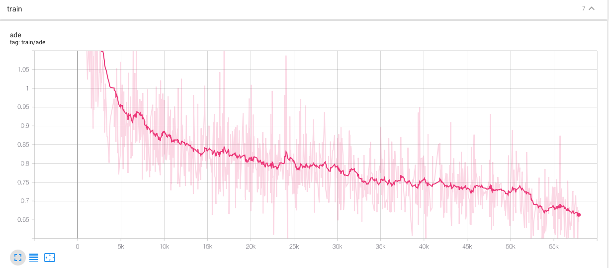

# LaneGCNi_ref

Impelentation of LaneGCN ([Learning Lane Graph Representations for Motion Forecasting](https://arxiv.org/pdf/2007.13732.pdf))

[TOC]

## Intro

LaneGCN is designed to predict vehicles' future motion. Tthis project is a personal impelentation for only learning and academic purposes of paper [Learning Lane Graph Representations for Motion Forecasting](https://arxiv.org/pdf/2007.13732.pdf). **Uber's offical repo locates [here](https://github.com/uber-research/LaneGCN).**

Though the implementation borrowed some official code (mostly in the model part), compared with offical project, this work:

- refactors and reimplements some of LaneGCN and add more detailed comments
- changes the whole framework to make it easier to carry experiments with other models.
- reprocesses the data to [MXNet Recoard](https://mxnet.apache.org/versions/1.7/api/python/docs/api/mxnet/recordio/index.html) to make it more flexible to be used (compared with originally provided data, ref to [issue \#4](https://github.com/uber-research/LaneGCN/issues/4#issue-739058291)
- add visualization and evaluation (to [Argo eval.ai](https://eval.ai/web/challenges/challenge-page/454/overview)) script
- provide a environemnt docker


I do hope and believe this project can help some learners get familiar with spatial-temporal prediction and trajectory prediction conviniently and efficiently. If you find this work is interesting, please also see and refer to the [official work](https://github.com/uber-research/LaneGCN).

## Prepare

### Environment preparation

1.  make sure you have `nvidia-docker` installed in your machine or follow the [instruction](https://github.com/NVIDIA/nvidia-docker#quick-start) to install it. 

2.  pull and start a container 

    ```shell
    docker pull zhaone/lanegcn:v1 # cost some time, size: about 30G (with data)
    sh ./startc.sh # start a container
    # you will get a container_id like: e563f358af72fd60c14c5a5...
    docker exec -it e563(your container_id) /bin/bash
    ```

    All the following operations happen in the container.

3.  now you should be at `/workspace/`of container, then clone this respo to `/workspace/` 

    ```shell
    git clone git@github.com:zhaone/LaneGCN_ref.git
    ```

### Data preparation

In container `/workspace/`

```shell
tar -xzf ./datasets.tar.gz 
```

Bingo!

## Training

To train the model, locate to root dir of this project and run

```shell
bash ./run_exp.sh lanegcn_ori train
```

Some experimenet args can be found and modified in file `commands/lanegcn_ori.sh`

```shell
train() {
  horovodrun -np 4 python cli.py \ # 4 means using 4 gpus
    --mixed_precision \ # open mixed_precision training
    --epochs 36 \ # total training epoches
    --lr 0.001 \ # base learning rate
    --lr_decay 0.90 \ # lr decar rate
    --min_decay 0.1 \ # min lr decay rate
    --save_checkpoints_steps 100 \ # step interval of save model
    --print_steps 10 \ # step interval of printing on screen
    --board_steps 50 \ # step interval of writing tensorboard
    --eval_steps 1600 \ # step interval of evaluate the eval dataset
    --is_dist \ # use multiple gpus, if you have only one gpu, delete this arg
    --optimizer "adam" \ # step type of optimizer
    --pin_memory \ # dataloader arg
    --name "val_exp" \ # experiment name
    --model "lanegcn_ori" \ # model name
    --hparams_path "hparams/lanegcn_ori.json" \ # hyperparameters of model
    --num_workers 0 \ # dataloader arg
    --data_name "lanegcn" \ # data set name
    --data_version "full" \ # data set version
    --mode "train_eval" \ # experiment type
    --save_path "/workspace/expout/lanegcn/train" \ # output dir
    --batch_size 32 \
    --reload "latest" # type of model loaded when resume the training, best or latest
}
```

All the output of the experiment will be save in `save_path` which have the following structure:

```plaintxt
.
|-- env	# save some experiment configuration
|   |-- args.json	# experiment args
|   |-- hparams.json	# model hyperparameters
|   `-- src.tar.gz	# source code (model part)
|-- eval # 
|   |-- BEST-train_eval-debug-debug.json
|   |-- lanegcn_ori-eval-debug-000057800.json
|   |-- lanegcn_ori-train_eval-debug-000001600.json
|   |-- ...
|   |-- lanegcn_ori-train_eval-debug-000056000.json
|   `-- lanegcn_ori-train_eval-debug-000057600.json
|-- hooks # custom hooks
|   |-- hook_eval_vis # visualization of predcition svg
|   `-- hook_test_submit # prediction results of test dataset
|       |-- res_0.pkl
|       |-- res_1.pkl
|       `-- res_mgpu.h5 # prediction results of test dataset
|-- log # tensorboard event
|   |-- events.out.tfevents.1610454343.22683b51c1b9
|   |-- events.out.tfevents.1610784779.22683b51c1b9
|   |-- events.out.tfevents.1614741403.0f7fe7279276
|   |-- key.txt
|   `-- log.txt
`-- params # model params
    |-- best-000036800.params
    |-- best-000040000.params
    |-- best-000041600.params
    |-- best-000043200.params
    |-- best-000048000.params
    |-- best-000052800.params
    |-- best-000054400.params
    |-- latest-000057200.params
    |-- latest-000057300.params
    |-- latest-000057400.params
    |-- latest-000057500.params
    |-- latest-000057600.params
    |-- latest-000057700.params
    |-- latest-000057800.params
    `-- meta.json # some meta info
```

**Note: persist data in host machine**

If you want to save output in the **host machine** rather than docker container, you can add a volume bind in [startc.sh](./startsc.sh) like:

```shell
docker run \
    --runtime=nvidia \
    --name lanegcn \
    --rm \
    --shm-size="20g" \
    -d \
    -v /tmp/lanegcn(your persisting host directory):/workspace/expout(root save_path in container) \ # add this binding to persist data in host machine
    -p 0.0.0.0:16006:6006 \
    -it \
    zhaoyi/lanegcn:v3 \
```


But make sure container have writing **permission** of host bind directory (like ... change permission of host bind dir to 777).

### Visualize training

```shell
tensorboard --logdir=your save_path --bind_all --port 6006
```

Then you can access tensorboard by address `docker_host_machine_ip:16006` (port binding is in file [startc.sh](./startsc.sh).

## Evaluation

To evaluate model's performence on evluation set, run

```shell
bash ./run_exp.sh lanegcn_ori val
```

### Visualize prediction

If you want to visualize the prediction results, add `--enable_hook` args to

```shell
val() {
  horovodrun -np 4 python cli.py \
    --mixed_precision \
    --epochs 36 \
    ...
    --reload "latest" \
    --enable_hook # add this arg to visulzie when eval
}
```

The predcition for each sample will be saved in `save_path/hooks/hook_eval_vis` in `.svg` format. 

Note

-   It will draw each evaluation sample and its prediciton, press `ctrl+c` to stop ploting when you feel it is enough
-   script locates at `util/argo_vis.py`. You can modify this script to customize.

## Testing

To generate prediction, run

```shell
bash ./run_exp.sh lanegcn_ori _test
```

### Submit to [Argo eval.ai](https://eval.ai/web/challenges/challenge-page/454/overview)

If you want to generate h5 result file that can be submitted on to [Argo eval.ai](https://eval.ai/web/challenges/challenge-page/454/overview), add `--enable_hook` args to

```shell
test() {
  horovodrun -np 4 python cli.py \
    --mixed_precision \
    --epochs 36 \
    --reload "latest" \
    --enable_hook # add this arg to generate result h5 file
}
```

Output result file locates at `save_path/hooks/hook_test_submit/res_mgpu.h5`, then you can upload it to the website.

## Performence

Training



Evalution reuslt


## Other materials

[awesome trjactory prediction](https://github.com/jiachenli94/Awesome-Interaction-aware-Trajectory-Prediction)

## Contact

Please propose issues or mail yizhaome@gmail.com.

